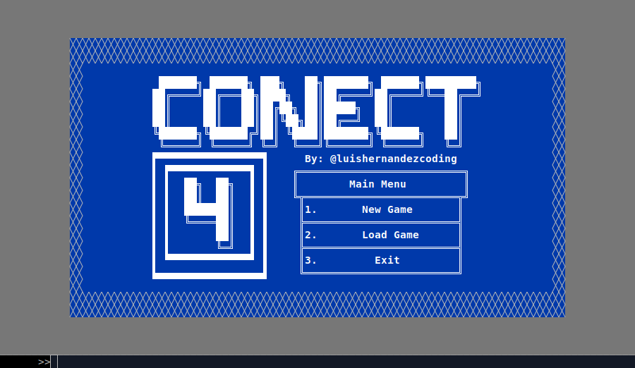
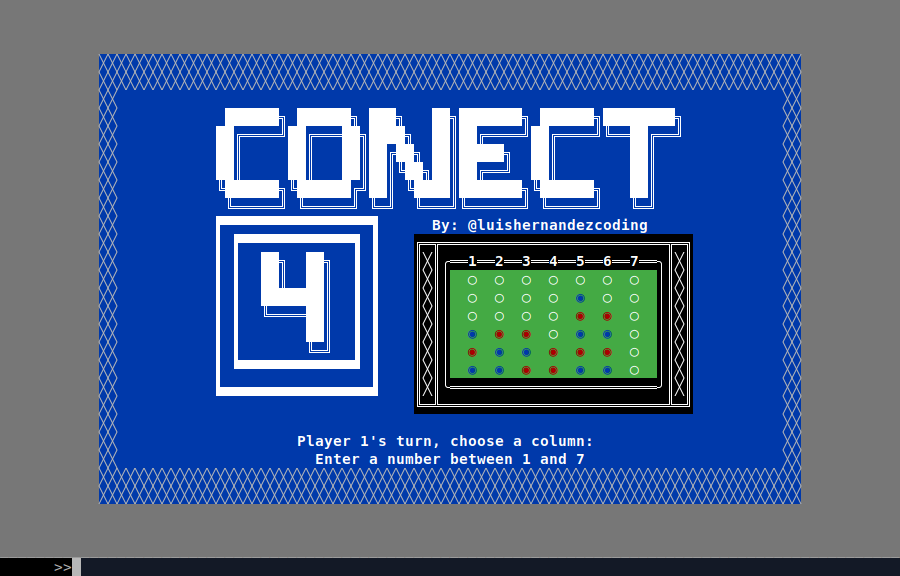

# Ruby Connect Four

In this project, i built a Connect 4 game that can be executed from the console, The objective of Connect Four is to be the first player to form a horizontal, vertical, or diagonal line of four of one's own discs.




###### Definition
> 'Connect 4 its a two-player connection game in which the players take turns dropping colored discs from the top into a seven-column, six-row vertically suspended grid. The pieces fall straight down, occupying the next available space within the column. The object of the game is to be the first to form a horizontal, vertical, or diagonal line of four of one's own discs. Connect Four is a solved game. The first player can always win by playing the right moves.'

###### Behavior
- The game prompts the first player to choose a column.
- The game prompts the second player to choose a column.
- The game displays the board after every move.
- The game displays the winner after every move.
- The game displays a draw if the board is full.
- The game displays the winner if a player connects four discs.
- The game displays the winner if a player connects four discs diagonally.
- The game displays the winner if a player connects four discs vertically.
- The game displays the winner if a player connects four discs horizontally.

## Learning Goals / Areas of Focus

- Test Driven Development (TDD)
- Object Oriented Programming (OOP)
- Data Structures & Algorithms

## Extra Learning Goals / Areas of Focus

- Use Ruby to build a command line application
- Practice breaking a program into logical components
- Use Ruby's built-in Hash class to store board state
- Use enumerable to iterate over multi-dimensional collections (arrays of hashes, in this case)
- Use conditionals to build the game logic
- Use methods to encapsulate game logic
- Use git frequently with descriptive commit messages

## Built With

- Ruby
- Rubocop
- VS Code

## Getting Started

To get a local copy up and running follow these simple example steps.

### Prerequisites

- Ruby v 3.1.2p20

### Setup

- Make sure you have Ruby installed on your machine
- Clone this repository with
```bash
git clone git@github.com:LuisHernandezCoding/ruby_connect_four.git
```

### Usage

- Navigate with your console to the project folder
- Run the program on your local machine with

```bash
ruby bin/main.rb
```

### Run tests

- Navigate with your console to the project folder
- Run the program on your local machine with

```bash
rspec
```

## Authors

👤 **Luis Hernandez**

- GitHub: [@LuisHernandezCoding](